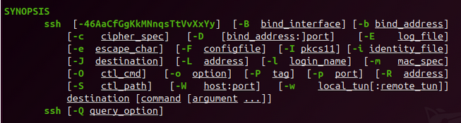

# Introducción

Guía completa de sistemas y servicios clave de Linux, comandos útiles y ejemplos prácticos 

- Incluye tutorial de Vim para moverse por terminal. 

- Incluye un apartado especial sobre el kernel de Linux para entender su funcionamiento y configuración. Modificaremos parámetros del kernel y compilaremos uno personalizado . 

<br><br>

# Distribuciones de Linux en entornos empresariales

En el ecosistema Linux existen cientos de distribuciones, pero en la práctica solo unas pocas dominan el ámbito empresarial. En ámbito empresarial la elección no suele depender de preferencias personales, sino de factores como estabilidad, soporte a largo plazo, seguridad y ecosistema de herramientas.

- Ubuntu/Debian → comunidad enorme, flexibilidad, ecosistema muy activo.

- RHEL/Rocky → soporte empresarial fuerte, certificaciones de software/hardware.

- SUSE (SLES / openSUSE Leap / Micro) → muy sólido en entornos corporativos y cloud, gran enfoque en estabilidad y administración (YaST, SUSE Manager, Kubernetes con Rancher).

- Proxmox → especializado en virtualización y contenedores, rápido de montar, interfaz web lista para producción.

Al elegir, lo importante no son gustos, sino estabilidad, soporte y seguridad. Pregúntate:

- ¿Tiene soporte oficial o una comunidad activa que asegure continuidad?
- ¿Qué rapidez tiene en aplicar parches críticos?
- ¿Existe buena documentación y ecosistema de herramientas?
- ¿Cuánto cuesta mantenerla (soporte, formación, licencias)?
- ¿Equilibra estabilidad con flexibilidad para nuevas tecnologías?

<br><br>

# Tipos de comandos en Linux con `compgen`

Si en la terminal pulsas TAB dos veces, verás una lista enorme de comandos disponibles. Pero, ¿sabías que existen diferentes tipos de comandos en Linux?

En Bash, el comando interno `compgen` permite listar los diferentes tipos de comandos que existen en el sistema:

## 1. Comandos internos (built-ins)

Son los comandos que **viven dentro de la shell** y no existen como binarios separados.

Ver todos los builtins:

```bash
compgen -b
```

## 2. Comandos externos (binarios en $PATH)

Son los ejecutables del sistema almacenados en rutas como /bin, /usr/bin, /usr/local/bin.

```bash
compgen -c
```

> Nota: compgen -c muestra todos los comandos ejecutables (incluye builtins, alias y funciones).

Para ver únicamente los binarios, puedes filtrarlos con type:

```bash
compgen -c | while read cmd; do type "$cmd" | grep -q 'file' && echo "$cmd"; done
```

## 3. Alias

Son atajos definidos en la shell (por ti o por configuración del sistema).

Ver todos los alias:

```bash
compgen -a
```

Para ver los alias definidos en tu sistema, puedes usar el comando `alias` sin argumentos.

---

> **Lectura recomendada**: 
> [Entendiendo el comando compgen](https://fraterneo.blogspot.com/2012/07/entendiendo-el-comando-compgen.html)

---

<br><br>

# El comando MAN

El comando man (manual) es la herramienta esencial para consultar la documentación de cualquier comando en Linux. No se trata solo de mostrar ayuda: aprender a leer e interpretar correctamente las páginas del manual es una habilidad clave para todo administrador de sistemas.

### La sintaxis básica es:

```bash
man [sección] comando
```

- [sección] → opcional, indica la sección del manual donde buscar.
- comando → el nombre del comando, función o fichero que queremos consultar.

### Estructura de una página man:

Aunque puede variar, normalmente veremos:

- NAME → nombre del comando y breve descripción.
- SYNOPSIS → aquí se encuentra la sintaxis del comando. Es la parte más importante y, al principio, la más confusa.
- DESCRIPTION → explicación detallada de las opciones.
- OPTIONS → listado de parámetros que se pueden usar con el comando.
- EXAMPLES → ejemplos prácticos (no todos los comandos los incluyen).
- SEE ALSO → otros comandos relacionados.

### Cómo leer la sintaxis en SYNOPSIS:

- [] → los corchetes indican que el elemento es opcional.
- < > → los ángulos muestran un valor que debes sustituir, como <file> o <user>.
- | → significa “o”, debes elegir una de las opciones.
- ... → indica que el elemento puede repetirse varias veces.
- { } → agrupan opciones que van juntas.

### Ejemplo con el comando man ssh



Esta parte puede ser la más confusa de todas -> ssh [-46AaCfGgKkMNnqsTtVvXxYy]

¿Qué significa?

- Eso es un conjunto de opciones cortas que se pueden usar de manera independiente o combinadas.
- Los corchetes [...] → indican que todas son opcionales.
- Las letras dentro → cada una corresponde a una opción corta de ssh.
- -4 → fuerza a usar IPv4.
- -6 → fuerza a usar IPv6.
- -A → habilita reenvío de agente de autenticación.
- -a → deshabilita reenvío de agente.
- -C → habilita compresión.
- -q → modo silencioso (quiet).
- -v → modo verbose (muestra más información).
- -vvv → aún más detallado (debug).

### Secciones de man

En Linux, las páginas del manual están divididas en secciones (no solo comandos). Por eso, cuando ejecutas man -f comando (o whatis comando), te devuelve todas las secciones en las que aparece.

Por ejemplo:

```bash
man -f open
```

Salida:

```bash
open (1)   - open a file descriptor
open (2)   - open and possibly create a file
```

Repaso de secciones:

- Sección 1: Comandos y aplicaciones de Shell.
- Sección 2: Servicios básicos del núcleo: llamadas al sistema y códigos de error.
- Sección 3: Información sobre bibliotecas para programadores.
- Sección 4: Servicios de red: si TCP/IP o NFS están instalados. Controladores de dispositivos y protocolos de red.
- Sección 5: Formatos de archivo estándar: por ejemplo, muestra cómo es un archivo tar.
- Sección 6: Juegos.
- Sección 7: Archivos y documentos varios.
- Sección 8: Comandos de administración y mantenimiento del sistema.
- Sección 9: Especificaciones e interfaces poco conocidas del núcleo.

### Dónde se almacenan y cómo se buscan las man pages

En Linux, las páginas del manual se distribuyen por secciones (1, 2, 3, …) en rutas conocidas. 

Lo más habitual:

- /usr/share/man/ → man pages instaladas por el sistema.
- /usr/local/share/man/ → man pages instaladas localmente por el administrador (prioridad sobre /usr).
- /opt/<paquete>/share/man → algunos paquetes autoinstalados guardan ahí su documentación.
- /var/cache/man/ → cat pages (páginas preformateadas en caché) e índices.

### La variable MANPATH (y el fichero de configuración de man) dictan en qué árboles buscar y en qué orden.

Ver tu ruta efectiva:

manpath

### Inspeccionar dónde está una página concreta:
-  man -w ssh     # primera encontrada
- man -aw ssh    # muestra todas las rutas donde existe

<br><br>

# Crear tus propias man pages

Estructura básica del archivo

Una man page es un archivo de texto escrito en troff/groff con macros específicas.

El formato es:

```
.TH NOMBRE SECCIÓN "FECHA" "VERSIÓN" "AUTOR/EMPRESA"
.SH NAME
nombre \- breve descripción
.SH SYNOPSIS
cómo se usa el comando
.SH DESCRIPTION
explicación detallada
.SH OPTIONS
\-a   Explicación de la opción -a  
\-b   Explicación de la opción -b
.SH EXAMPLES
Ejemplos de uso reales
.SH SEE ALSO
otros comandos relacionados
```

### Ubicación

- /usr/local/share/man/man1/

### Nombre del archivo

- Nombre: comando.sección → ej: mi-tool.1

### Comprimir la página

gzip -9 /usr/local/share/man/man1/mi-tool.1

Esto genera: /usr/local/share/man/man1/mi-tool.1.gz

### Actualizar la base de datos de man

Para que man reconozca tu página:

sudo mandb -q /usr/local/share/man

### Probar tu man page

man mi-tool

### Y si quieres ver todas las ubicaciones donde se encuentra:

man -aw mi-tool

---

> **Lectura recomendada**: 
> [Linux man page guide - It’s FOSS](https://itsfoss.com/linux-man-page-guide)

---

<br> <br>

# Navegación por el sistema de archivos

## Entendiendo la jerarquía de directorios

La jerarquía de directorios en Linux se basa en un sistema de archivos en forma de árbol. Aquí hay algunos de los directorios más importantes que encontrarás:

- `/` : El directorio raíz, donde empieza la jerarquía de archivos.
- `/bin` : Ejecutables esenciales para el sistema.
- `/sbin` : Ejecutables del sistema, generalmente para administración.
- `/usr` : Históricamente: “Unix System Resources”, no “user”. Es la jerarquía principal de software del sistema (binarios, librerías, documentación...). Por ejemplo, `/usr/bin` a diferencia de `/bin`, contiene aplicaciones y utilidades adicionales no esenciales para el arranque.
- `/usr/local` : Software instalado localmente, fuera del gestor de paquetes del sistema.
- `/etc` : Archivos de configuración del sistema.
- `/home` : Contiene los directorios personales de los usuarios.
- `/var` : Datos variables: logs, bases de datos temporales.
- `/tmp` : Archivos temporales, se suelen borrar al reiniciar.
- `/dev` : Archivos de dispositivos (hardware).
- `/proc` : Sistema de archivos virtual que proporciona información sobre procesos y el sistema.
- `/sys` : Sistema de archivos virtual que expone información del kernel y dispositivos.
- `/mnt` : Punto de montaje temporal para sistemas de archivos.
- `/media` : Punto de montaje para medios extraíbles (USB, CD-ROM).
- `/lib` : Bibliotecas compartidas necesarias para ejecutar programas.
- `/opt` : Software adicional y paquetes de terceros.
- `/root` : Directorio personal del usuario root (administrador).

Para ver la estructura completa, puedes usar el comando `tree`. 

El comando tree muestra el contenido de un directorio en forma de árbol jerárquico, lo que permite visualizar fácilmente la estructura de carpetas y subcarpetas.

Si no tienes `tree` instalado, puedes instalarlo con:

En Debian/Ubuntu:

```bash
sudo apt install tree
```

En RHEL/CentOS:

```bash
sudo yum install tree
```

```bash
tree -L 2 /
```

El parámetro `-L 2` limita la profundidad del árbol a 2 niveles, para evitar una salida demasiado larga. La / indica que quieres ver la estructura desde el directorio raíz.


## Comandos de movimiento y ubicación

Para moverte por el sistema de archivos y orientarte dentro de él, Linux ofrece varios comandos básicos pero muy potentes. Dominar estos comandos es esencial para trabajar de forma fluida desde la terminal.

### pwd — Print Working Directory

- Muestra la ruta completa del directorio actual.

### cd — Change Directory

- Cambia al directorio especificado.
- Existen dos formas de especificar rutas: absolutas y relativas.
- Ejemplos de ruta absoluta:
  - `cd /home/usuario/documentos` → Ir a documentos.
- Para las rutas relativas existen varios atajos:
  - `cd ..` → Sube un nivel (al directorio padre).
  - `cd ../..` → Sube dos niveles. Puedes combinar tantos `..` como necesites.
  - `cd ./` → Permanece en el directorio actual.
  - `cd -` → Vuelve al directorio anterior.
  - `cd` o `cd ~` → Va al directorio home del usuario actual.
  - `cd ~usuario` → Va al home de otro usuario (requiere permisos).
  - `cd /` → Va al directorio raíz.

### ls — List Directory Contents

- Muestra el contenido del directorio actual o de uno especificado.
- Ejemplos de uso:
  - `ls` → Lista los archivos y carpetas en el directorio actual.
  - `ls -a` → Muestra todos los archivos, incluidos los ocultos (que empiezan con .).
  - `ls -l` → Muestra una lista detallada (permisos, propietario, tamaño, fecha).
  - `ls -lah` → Muestra una lista detallada con tamaños legibles por humanos (ej. 1K, 234M, 2G).
  - `ls -R` → Lista los archivos y carpetas de forma recursiva.

# Visualización de ficheros

Objetivo: aprender a leer información sin modificarla, inspeccionar archivos de configuración, analizar logs y combinar herramientas de lectura con filtros como grep, sort o uniq.

Antes de manipular archivos, es fundamental saber cómo leerlos e interpretarlos correctamente. Linux ofrece varios comandos para este propósito. También necesitamos saber que son los logs y dónde encontrarlos.

Los logs son archivos donde el sistema y las aplicaciones registran eventos, errores y actividades. Son esenciales para diagnosticar problemas y entender el comportamiento del sistema.

### Comandos básicos

- `cat` → Muestra el contenido de un archivo.
  - -n → Numera las líneas.
  - -E → Muestra los finales de línea con $ (útil para ver saltos).
  - -s → Suprime líneas en blanco repetidas.
- `more` → Muestra el contenido de un archivo página por página.
- `less` → less es el visor de texto estándar en Linux. Permite desplazarse, buscar y moverse libremente sin cargar todo el archivo en memoria.
  - Navegación:
    - Barra espaciadora → Avanza una página.
    - b → Retrocede una página.
    - Enter → Avanza una línea.
    - ↓ → Desplazarse hacia abajo.
    - ↑ → Desplazarse hacia arriba.
    - /texto → Busca "texto" hacia adelante.
    - ?texto → Busca "texto" hacia atrás.
    - n → Repite la búsqueda en la misma dirección.
    - N → Repite la búsqueda en la dirección opuesta.
    - g → Va al principio del archivo.
    - G → Va al final del archivo.
    - q → Sale de less. 
- `head` → Muestra las primeras líneas de un archivo.
  - -n N → Muestra las primeras N líneas (por defecto 10). 
- `tail` → Muestra las últimas líneas de un archivo.
  - -n N → Muestra las últimas N líneas (por defecto 10).
  - -f → Sigue mostrando nuevas líneas en tiempo real (útil para logs). Significa "follow".
- `nl` → Numera las líneas de un archivo. Similar a `cat -n`, pero con más opciones de formato.
- `wc` → Cuenta líneas, palabras y bytes en un archivo.
  -  Salida: líneas, palabras, bytes y nombre del archivo.
  -  -l → Solo cuenta líneas.
  -  -w → Solo cuenta palabras.
  -  -c → Solo cuenta bytes.
- `strings` → Extrae cadenas de texto legibles de archivos binarios.